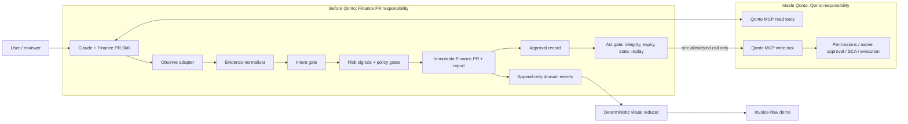
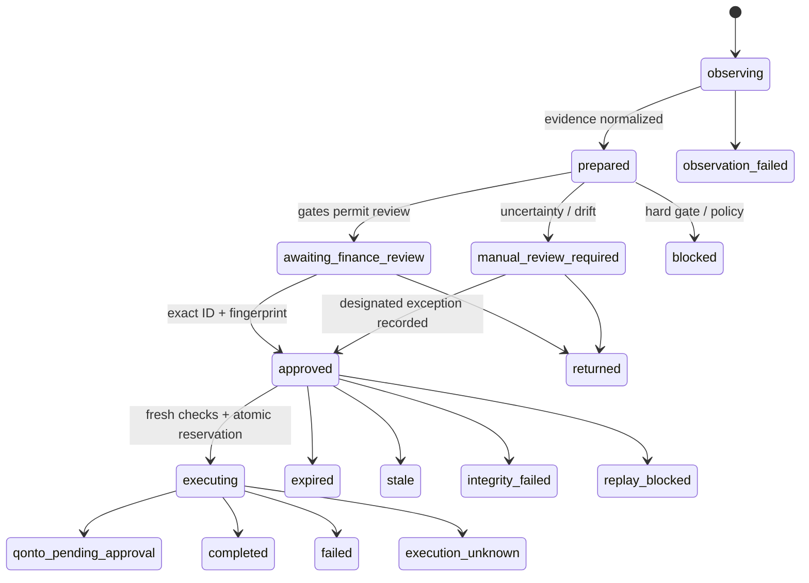

# Architecture

## 1. Architectural outcome

Build a local, auditable Finance PR engine with a Claude Skill as the Qonto MCP orchestrator and a separate event-driven visual demo. Qonto MCP remains the only Qonto integration surface. The MVP does not introduce another remote MCP server, multi-tenant backend, or production database.

This is a **REIMPLEMENT / MVP** design. It keeps interception, check-result, escalation, and audit concepts while removing its FastAPI/PostgreSQL/multi-tenant stack. It keeps FlowTwin's deterministic replay model while removing the hospital-specific world.

## 2. System boundary

Before Qonto, Finance PR validates intent, evidence, risk, business policy, proposal integrity, and reviewer binding. Inside Qonto, Qonto validates identity, scopes, permissions, native approval, SCA, and execution. A Finance PR approval is not a Qonto approval.

## 3. Components

### 3.1 Claude Skill

**MVP / new design.** The Skill is the user-facing workflow contract.

Responsibilities:

- inspect and call the real Qonto MCP read tools;
- capture the literal user request separately from untrusted tool/document text;
- normalize Qonto results into engine input;
- call local `observe`, `prepare`, `approve`, and `act` commands/scripts;
- display the report and exact approval syntax;
- refuse direct writes outside Act;
- require an additional explicit test confirmation before any sandbox write.

Limitation: a Skill is an orchestration control, not a cryptographic enforcement boundary against another client or a manually invoked Qonto tool. The demo and claims must say “protected Finance PR workflow,” not “all Qonto MCP writes are impossible to bypass.” A hardened MCP proxy is roadmap.

### 3.2 Evidence normalizer

**MVP / new design using Qonto requirements.** Converts tool-specific responses into typed evidence:

- `membership_snapshot`;
- `organization_snapshot`;
- `supplier_invoice_snapshot`;
- `supplier_history_snapshot`;
- `transaction_match_snapshot`;
- `request_snapshot`;
- optional `attachment_digest`.

Each record contains `source`, `source_object_id`, `observed_at`, `data_mode`, a minimal structured payload, availability, and a digest. Unknown fields remain absent with an explicit reason. Tool responses are never interpolated into executable instructions.

### 3.3 Finance PR core

**MVP.** Pure deterministic functions where possible:

- validate schemas;
- evaluate hard gates;
- evaluate normalized risk signals;
- compute coverage and risk band;
- evaluate policy routing;
- render redacted human report;
- canonicalize immutable JSON and hash it;
- emit domain events.

Avoid LLM calls inside deterministic checks.

### 3.4 Store

**MVP / new design.** A small local SQLite store is recommended because Python includes SQLite and it supports transactions needed for replay protection.

Logical tables:

- `finance_pr`: immutable canonical body, hash, fingerprint, created/expires, policy version;
- `approval`: PR ID, fingerprint, reviewer reference, decision, timestamp, note;
- `execution`: status, reservation token, started/completed time, action type, redacted result;
- `event`: monotonic sequence, PR ID, event type, timestamp, sanitized payload;

The implementation should reject any update to the immutable body. New preparation creates a new PR ID.

### 3.5 Act gate

**MVP / new design.** The only route in the protected workflow to a write tool.

Input: PR ID and approval reference only. It must not accept amount, IBAN, supplier, invoice, action type, or free-form payload.

Validation order:

1. Load immutable body and recompute hash.
2. Validate supplied fingerprint and stored approval binding.
3. Validate expiry, policy decision, reviewer route, and execution state.
4. Re-read the target from Qonto.
5. Compare critical state.
6. In one local transaction, change `approved -> executing` only if still unused.
7. Make exactly one allowlisted Qonto call.
8. Record `submitted`, `qonto_pending_approval`, `completed`, `failed`, or `execution_unknown`.

Any failure before step 6 makes no write. Any ambiguous result after step 7 forbids automatic retry.

### 3.6 Optional independent reviewer

**ROADMAP / optional MVP.** A provider-neutral interface with an OpenAI implementation behind a feature flag.

Input is a minimal sanitized packet:

- user request excerpt or semantic summary without personal data;
- proposed action type;
- masked supplier label;
- coarse amount band or exact amount only if policy allows;
- deterministic intent findings;
- disagreement summary.

Output schema:

- `verdict: agree | unclear | disagree | escalate`;
- `reasons: string[]`;
- `confidence_for_triage` (display-only, never a safety metric);
- `model`, `request_id`, and timestamp.

Combination rule: the result can add a manual-review requirement. It cannot turn fail/unknown into pass, lower a deterministic score, waive a gate, or authorize Act. Required-review unavailability yields manual review.

### 3.7 Visual event reducer

**MVP / simplified from FlowTwin.** A React/Vite view consumes the engine's event schema and computes `worldAt(sequence_or_time, events)` as a pure reducer. Synthetic scenario events are generated through the same Finance PR core used by tests.

The visual layer never invents status transitions. It can interpolate movement between the previous and next real event, but state, dwell, and counts come only from events.

## 4. State machines

### 4.1 Finance PR lifecycle

`approved` means Finance PR approval only. `qonto_pending_approval` is the boundary-crossing result. Only Qonto can produce its native approval/execution states.

### 4.2 Invoice visual states

The visual supports the requested rooms but uses only states reached by actual events:

1. Invoice Intake
2. Qonto Data
3. Intent Gate
4. Risk Analysis
5. Independent Review (optional; hidden or marked skipped when disabled)
6. Finance Review
7. Designated Approver (only when policy routes there; never assumed CFO/CEO role)
8. Qonto Boundary
9. Native Qonto Approval
10. Completed / Returned / Blocked

The visual must not animate an invoice into Native Qonto Approval unless a real or explicitly synthetic event says the write was submitted to that workflow.

## 5. Event contract

Minimum event envelope:

| Field | Meaning |
|---|---|
| `event_id` | Unique event identifier |
| `sequence` | Strictly increasing per PR |
| `occurred_at` | ISO-8601 timestamp |
| `finance_pr_id` | Aggregate identifier |
| `invoice_ref_masked` | Safe display label |
| `type` | Closed event vocabulary |
| `from_state` / `to_state` | Valid transition or null for annotations |
| `actor_kind` | user, skill, engine, reviewer, second_model, qonto |
| `data_mode` | synthetic or qonto_sandbox |
| `payload` | Sanitized typed details only |

Core event types:

- `invoice_observed`;
- `intent_classified`;
- `evidence_collected` / `evidence_missing`;
- `signal_evaluated`;
- `hard_gate_evaluated`;
- `second_review_requested/completed/unavailable`;
- `finance_pr_prepared`;
- `finance_review_requested`;
- `finance_pr_approved/returned/expired`;
- `act_revalidation_started`;
- `integrity_failed/state_stale/replay_blocked`;
- `qonto_write_submitted`;
- `qonto_native_approval_pending`;
- `qonto_action_completed/failed/unknown`.

## 6. Canonicalization and integrity

Recommended approach: RFC 8785 JSON Canonicalization Scheme or an equivalently documented canonical JSON implementation with deterministic Unicode, number, key-order, and null handling. Hash canonical UTF-8 bytes with SHA-256.

Fingerprint format: first 8 hexadecimal hash characters grouped as `ABCD-1234`. This is a human comparison aid, not a substitute for full-hash verification. The full hash is always recomputed in Act.

Timestamps and volatile display fields must be fixed before hashing. Approval and lifecycle fields must not be embedded in the body after hashing.

## 7. Critical-state comparison

Prepare records a digest over the critical fields actually returned by Qonto. Act re-reads and compares at least:

- organization and target invoice IDs;
- invoice status and available action;
- supplier identity reference;
- invoice number;
- exact decimal amount and currency;
- normalized IBAN or beneficiary reference;
- attachment/content reference when required;
- matched transaction/payment state;
- relevant request/native approval state;
- `updated_at` when supplied.

Any changed critical field invalidates the PR. A new PR is required; do not patch and reuse the old approval.

## 8. Data and privacy

- Keep raw Qonto data in process only as long as needed.
- Persist minimal snapshots/digests and masked display values.
- Never send raw attachment contents to the optional second model.
- Never persist pre-signed attachment URLs.
- Log last four IBAN characters at most; avoid full member names/emails and opaque IDs in UI.
- Include a fixture validator that rejects obvious real IBANs, long opaque IDs, emails, and temporary URLs from committed synthetic data.

## 9. Failure semantics

| Failure | Required behavior |
|---|---|
| Qonto read unavailable | Prepare with `insufficient_data` or stop; no pass inference |
| Second model unavailable | Manual review if policy required it |
| Hash/fingerprint mismatch | Block and emit integrity event |
| State changed | Mark stale and require new PR |
| Expired | Mark expired and require new PR |
| Already used/executing | Block replay |
| Qonto write definite failure | Record failure; no hidden retry |
| Qonto write ambiguous | Record `execution_unknown`; reconcile by read before any new action |

## 10. Qonto integration discovery gate

Claude Code must begin implementation by writing a tool-surface inventory with:

- exact MCP tool name and purpose;
- read/write classification;
- required and optional arguments;
- returned critical fields and pagination;
- native status values;
- mutation idempotency support;
- Qonto approval/SCA behavior;
- safe sandbox test plan.

Local configuration currently allowlists five read tools: authenticated membership, organization, requests, supplier invoices, and transactions. That is evidence of the local setup, not a guarantee of the complete tool surface. No architecture decision may depend on an undiscovered write tool.

Official Qonto references for implementation verification:

- [Authentication and endpoint access](https://docs.qonto.com/get-started/business-api/authentication/introduction)
- [Available OAuth scopes](https://docs.qonto.com/get-started/business-api/authentication/oauth/available-scopes)
- [Strong Customer Authentication](https://docs.qonto.com/api-reference/business-api/authentication/sca/sca-flows)

